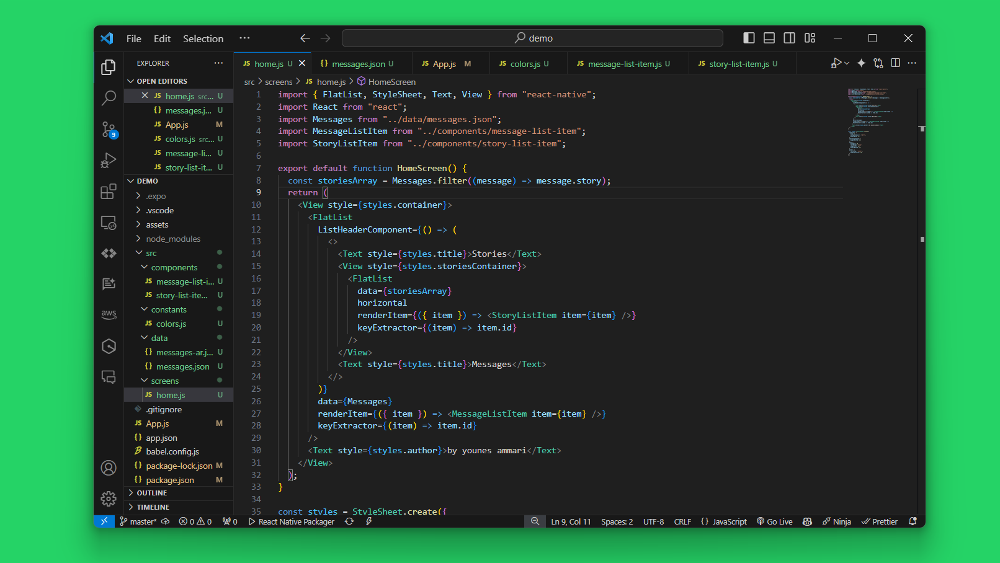
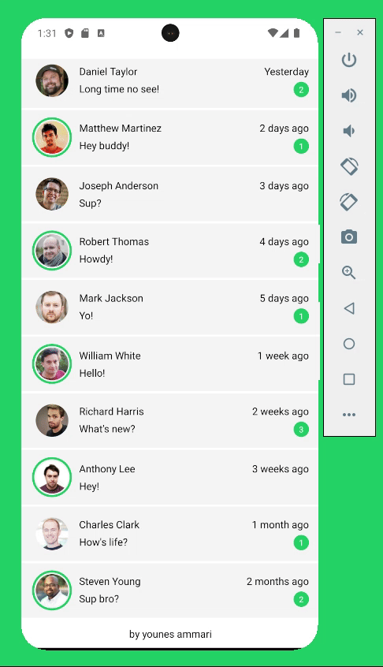
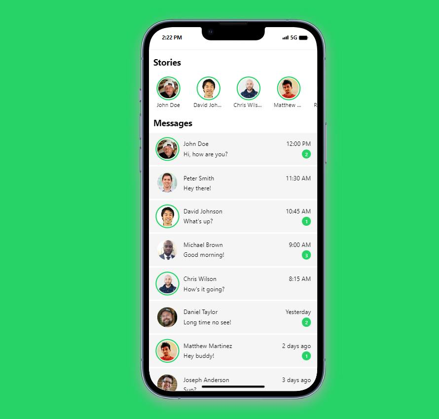
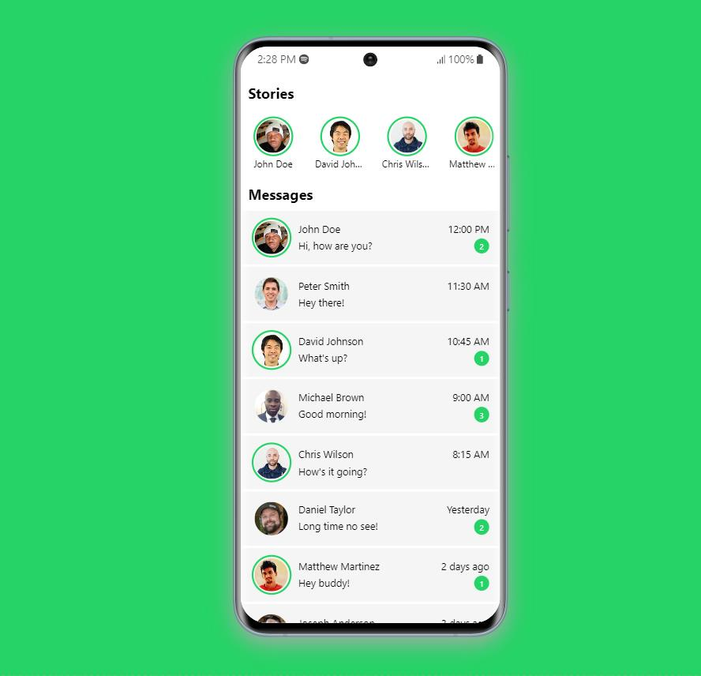

# WhatsApp Clone with React Native

This project is a clone of the messages screen from WhatsApp, built using React Native and Expo CLI. It allows you to recreate the look and feel of WhatsApp's messaging interface in your own applications.

# Preview



Watch a video preview.



# Getting Started

To get started with this project, follow these steps:

## 1. Clone this repository to your local machine:

```bash
git clone https://github.com/younes-ammari/whatsapp-clone-messages-screen.git
```

## 2. Setting up environment
```bash
npm install
```

## 3. How to run

Run on iOS simulator
```bash
npm run ios
```



Run on Android simulator/device
```bash
npm run android
```


Run on web
```bash
npm run web
```

# About

This project uses:

- [React](https://reactjs.org/) - a JavaScript library for building user interfaces
- [React Native](https://reactnative.dev/) - a framework for building native apps using React
- [Expo](https://expo.dev/) - a framework and a platform for universal React applications

